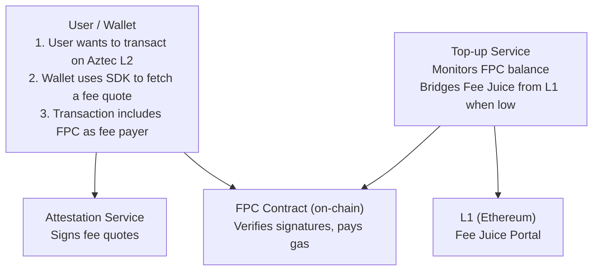
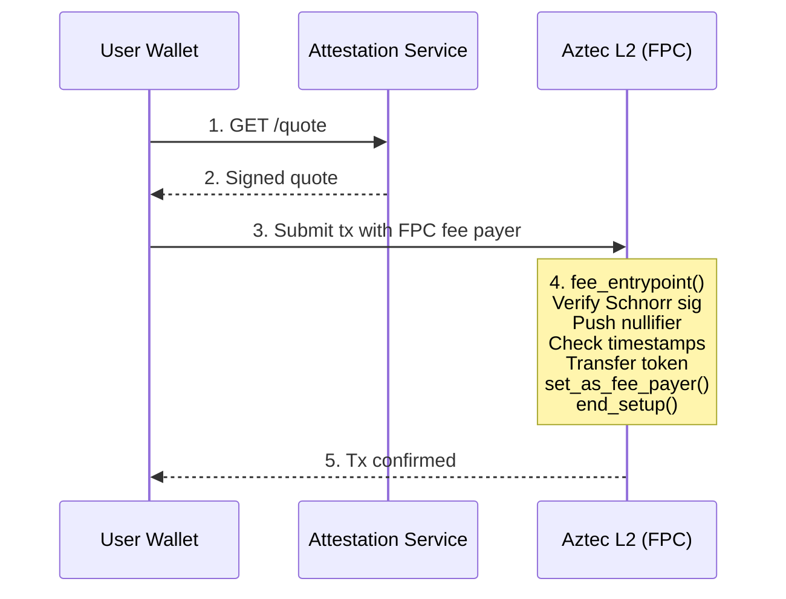
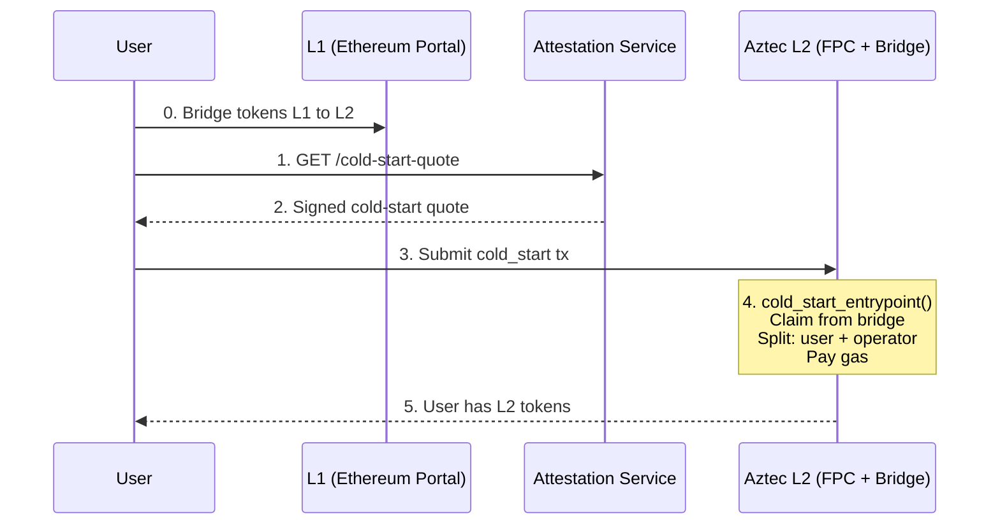
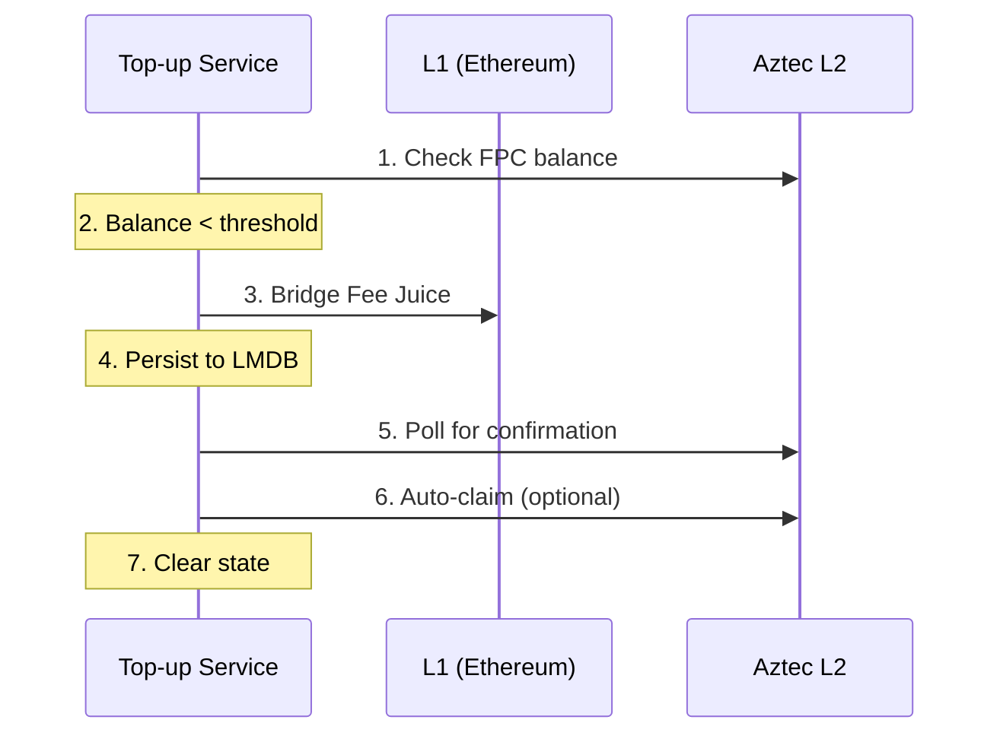

# Architecture

The FPC system has four components that work together to abstract gas payments: a smart contract on Aztec L2, two operator-run off-chain services, and a client-side SDK.

> [!TIP]
> **Where do you fit?**
>
> - **Wallet team** (Azguard, Obsidion): deploy the contract, run attestation + top-up, integrate the SDK in your wallet UI.
> - **dApp or DEX** (Shieldswap, Nemi): use the SDK against an operator you trust, or run your own attestation service. You never touch the contract directly.
> - **Bridge builder** (Substance Labs, TRAIN, Wormhole): use the SDK's `executeColdStart()`. The [Cold-Start flow diagram](#cold-start) below is what matters to you.

## System diagram

## Component roles

### FPC contract (on-chain)

[Source: `contracts/fpc/src/main.nr`](https://github.com/NethermindEth/aztec-fpc/blob/main/contracts/fpc/src/main.nr#L23)

The core smart contract deployed on Aztec L2, written in Noir (Aztec.nr).

Storage is a single packed immutable config slot containing `operator`, `operator_pubkey_x`, and `operator_pubkey_y`. There is no mutable admin state after deployment.

**Responsibilities:**

- Holds a Fee Juice balance to pay gas on behalf of users
- Verifies Schnorr-signed fee quotes from the operator against the stored public key
- Calls `transfer_private_to_private` to move the user's payment token to the operator's private balance
- Declares itself as fee payer via `set_as_fee_payer()` and ends the setup phase with `end_setup()`
- Pushes the quote hash as a nullifier to prevent replay

**Two entrypoints:**

- `fee_entrypoint(accepted_asset, authwit_nonce, fj_fee_amount, aa_payment_amount, valid_until, quote_sig)` for users with an existing L2 token balance
- `cold_start_entrypoint` for new users claiming bridged L1 tokens and paying in one transaction

The token transfer executes in the setup phase and is irrevocably committed. No teardown is scheduled. No tokens accumulate in this contract's balance.

### Attestation service (off-chain)

[Source: `services/attestation/src/server.ts`](https://github.com/NethermindEth/aztec-fpc/blob/main/services/attestation/src/server.ts#L817)

A Fastify REST API run by the FPC operator.

**Responsibilities:**

- Accepts quote requests with `user`, `accepted_asset`, and `fj_amount` parameters
- Computes exchange rates using `market_rate_num / market_rate_den` plus operator margin (`fee_bips`)
- Signs quotes with the operator's Schnorr private key using `computeInnerAuthWitHash` from `@aztec/stdlib/auth-witness`
- Serves wallet discovery metadata at `GET /.well-known/fpc.json`
- Manages asset pricing policies via admin endpoints (add, update, remove assets at runtime)
- Exposes Prometheus metrics for monitoring

For multi-asset deployments, each `supported_assets` entry can override the top-level rate values with asset-specific `market_rate_num`, `market_rate_den`, and `fee_bips`.

### Top-up service (off-chain)

[Source: `services/topup/src/index.ts`](https://github.com/NethermindEth/aztec-fpc/blob/main/services/topup/src/index.ts#L527)

A background daemon that keeps the FPC solvent.

**Responsibilities:**

- Periodically reads the FPC's Fee Juice balance on L2
- When balance drops below `threshold`, bridges Fee Juice via `L1FeeJuicePortalManager.bridgeTokensPublic(...)` on L1
- Tracks in-flight bridges in LMDB for crash recovery
- Waits for L1-to-L2 message readiness, with balance-delta polling as a fallback confirmation signal
- Optionally auto-claims bridged tokens on L2

Configuration fields `l1_chain_id` and Fee Juice L1 contract addresses are derived from `nodeInfo`. The service validates that the configured `l1_rpc_url` matches the node's L1 chain ID.

### SDK (client-side)

[Source: `sdk/src/payment-method.ts`](https://github.com/NethermindEth/aztec-fpc/blob/main/sdk/src/payment-method.ts#L50)

A TypeScript library (`@nethermindeth/aztec-fpc-sdk`) wrapping the attestation API and Aztec.js.

**Responsibilities:**

- Fetches quotes from the attestation service
- Constructs `FeePaymentMethod` objects for Aztec.js
- Handles authorization witnesses (authwits) for the token transfer
- Supports both standard (`createPaymentMethod`) and cold-start (`executeColdStart`) flows

## Data flows

### Standard fee payment

In step 4, the contract performs these checks in order ([Source](https://github.com/NethermindEth/aztec-fpc/blob/main/contracts/fpc/src/main.nr#L79)):

1. Asserts it is not in the revertible phase (conditional on non-zero gas fees)
2. Reads packed config from storage (operator address and signing pubkey)
3. Verifies the Schnorr quote signature, binding `user_address = msg_sender`, pushes the quote hash as a nullifier (duplicate quotes fail via nullifier conflict), asserts `anchor_block_timestamp <= valid_until`, and asserts `(valid_until - anchor_block_timestamp) <= 3600` seconds
4. Asserts `fj_fee_amount == get_max_gas_cost(...)` for the transaction gas settings
5. Calls `Token::at(accepted_asset).transfer_private_to_private(sender, operator, aa_payment_amount, nonce)`
6. Calls `set_as_fee_payer()` + `end_setup()`

### Cold start

The cold-start quote uses a different domain separator (`0x46504373`, ASCII `FPCs`) and includes `claim_amount` and `claim_secret_hash` in the hash preimage. This prevents cross-entrypoint quote reuse.

### Top-up

The service uses `L1FeeJuicePortalManager.new(node, client, logger)` to build the L1 client. After submitting the bridge transaction, it waits for L1-to-L2 message readiness via `waitForL1ToL2MessageReady`, then continues polling the FPC Fee Juice balance as a final fallback confirmation signal. An in-flight guard prevents multiple concurrent bridges. If the process crashes mid-bridge, the L1 transaction still completes and L2 receives the funds.

## Interface map

| From | To | Interface | Protocol |
|------|----|-----------|----------|
| Wallet/SDK | Attestation | HTTP REST | `GET /quote`, `GET /cold-start-quote`, `GET /accepted-assets`, `GET /.well-known/fpc.json` |
| Wallet/SDK | FPC Contract | Aztec tx | `fee_entrypoint()`, `cold_start_entrypoint()` |
| Top-up | L1 Portal | Ethereum tx | `L1FeeJuicePortalManager.bridgeTokensPublic()` |
| Top-up | Aztec L2 | Aztec tx | `FeeJuice.claim()` (auto-claim) |
| Attestation | Aztec Node | PXE RPC | Gas estimation, operator note discovery, `node_getNodeInfo` |
| FPC Contract | Token Contract | Aztec call (private) | `transfer_private_to_private(user, operator, amount, nonce)` |

## Operator model

A single operator runs both off-chain services and holds the keys.

| Key | Purpose | Rotation |
|-----|---------|----------|
| **L2 Schnorr keypair** | Signs quotes; pubkey stored immutably in FPC contract | Requires contract redeployment |
| **L1 private key** | Bridges Fee Juice from L1 | Config change + service restart |
| **Admin API key** | Protects attestation admin endpoints | Env var change + service restart |

The operator earns revenue from the spread between Fee Juice cost and token payment (`fee_bips`). All fee payments arrive directly in the operator's private balance as private notes. The operator must use their PXE to discover incoming notes and maintain off-chain accounting.

> [!TIP]
>
> For production deployments, use KMS or HSM for operator keys. See [Security Model](./security.md) for key management details and the production checklist.
