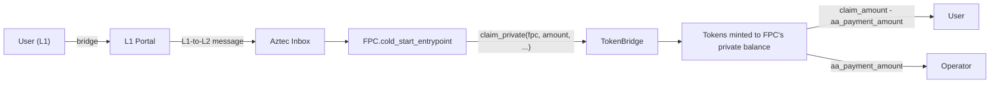

# Contracts

All smart contracts in the FPC system are written in Noir using the Aztec.nr framework.

## Contract Map

```
contracts/
├── fpc/                 # Core: FPCMultiAsset
├── faucet/              # Test token dispenser
├── token_bridge/        # L1-L2 bridge
└── noop/                # Profiling baseline

vendor/                  # Git submodule: aztec-standards
├── Token/               # Standard fungible token
└── GenericProxy/        # Generic proxy contract
```

## At a Glance

| Contract | Purpose | Production? | Key Functions |
|----------|---------|:-----------:|---------------|
| [**FPCMultiAsset**](./contracts.md#fpcmultiasset) | Core fee payment | Yes | `fee_entrypoint`, `cold_start_entrypoint` |
| [**TokenBridge**](./contracts.md#tokenbridge) | L1-L2 token bridge | Yes | `claim_public`, `claim_private`, `exit_to_l1_public` |
| [**Faucet**](./contracts.md#faucet) | Test token dispenser | Devnet only | `drip`, `admin_drip` |
| **Noop** | Gate count benchmarking | No | `noop` |
| **Token** (vendor) | Standard fungible token | Yes | `transfer_public_to_public`, `mint_to_public` |

## Dependency Graph

```
FPCMultiAsset
    │
    ├──► Token (vendor)         transfers user tokens to operator
    ├──► TokenBridge             claims bridged tokens in cold_start
    └──► Fee Juice (protocol)   declares fee payer

Faucet
    └──► Token (vendor)         transfers drip amounts

TokenBridge
    └──► Token (vendor)         mints/burns on claim/exit
```

## Build System

Contracts are compiled as a Noir workspace:

```toml
# Nargo.toml
[workspace]
members = [
    "contracts/fpc",
    "contracts/faucet",
    "contracts/noop",
    "contracts/token_bridge",
    "mock/counter",
    "vendor/aztec-standards/src/generic_proxy",
    "vendor/aztec-standards/src/token_contract",
]
```

Compile all contracts:

```bash
aztec compile --workspace
```

Run tests for the FPC contract:

```bash
aztec test --package fpc
```

Generate TypeScript ABIs:

```bash
aztec codegen target -o codegen
```

After compilation, TypeScript ABIs are generated into `codegen/` for use by the services and SDK.

## FPCMultiAsset

Fee payment contract. Accepts operator-signed quotes and pays transaction gas on behalf of users.

**Source:** [`contracts/fpc/src/main.nr`](https://github.com/NethermindEth/aztec-fpc/blob/main/contracts/fpc/src/main.nr#L23)

---

### Design

The contract holds no on-chain token allowlist. Multi-asset support comes from quote binding: `accepted_asset` is included in the signed quote preimage, so substituting a different token at call time invalidates the Schnorr signature. Asset policy (rates, fees, which tokens are accepted) lives entirely in the off-chain attestation service. See [ADR-0001](https://github.com/NethermindEth/aztec-fpc/blob/main/docs/specs/spec/adr-0001-alpha-asset-model.md).

---

### Storage

```noir
struct Storage {
    config: PublicImmutable<Config>,
}
```

| Field | Type | Description |
|-------|------|-------------|
| `operator` | `AztecAddress` | Receives token payments |
| `operator_pubkey_x` | `Field` | Schnorr public key X coordinate |
| `operator_pubkey_y` | `Field` | Schnorr public key Y coordinate |

All fields are packed into a single `PublicImmutable<Config>` slot and set once at construction. There is no mutable admin state after deployment. Key rotation requires redeployment.

---

### `constructor`

```noir
#[external("public")]
#[initializer]
fn constructor(
    operator: AztecAddress,
    operator_pubkey_x: Field,
    operator_pubkey_y: Field,
)
```

Writes `Config` to `PublicImmutable`. Called once at deployment. Rejects a zero `operator` address. Validates that the provided public key point lies on the Grumpkin curve (`y^2 == x^3 - 17`).

---

### `fee_entrypoint`

Standard fee payment for users with an existing L2 token balance.

```noir
#[external("private")]
#[allow_phase_change]
fn fee_entrypoint(
    accepted_asset: AztecAddress,
    authwit_nonce: Field,
    fj_fee_amount: u128,
    aa_payment_amount: u128,
    valid_until: u64,
    quote_sig: [u8; 64],
)
```

**Parameters**

| Name | Type | Description |
|------|------|-------------|
| `accepted_asset` | `AztecAddress` | Token contract the user pays in |
| `authwit_nonce` | `Field` | Nonce for the token transfer authorization witness |
| `fj_fee_amount` | `u128` | Gas cost in Fee Juice (must equal `get_max_gas_cost` for the transaction gas settings) |
| `aa_payment_amount` | `u128` | Token amount the user pays |
| `valid_until` | `u64` | Quote expiry (unix seconds) |
| `quote_sig` | `[u8; 64]` | Operator Schnorr signature over the quote preimage |

**Execution steps**

1. Checks whether the transaction has non-zero max fees; if so, asserts setup-phase execution (`!in_revertible_phase`).
2. Reads packed `config` from storage (`operator`, signing pubkey).
3. Computes the quote hash via `compute_inner_authwit_hash` and verifies the Schnorr signature. Binds `user_address = msg_sender`, so a quote signed for one user cannot be used by another.
4. Pushes a nullifier derived from the quote hash. Duplicate quotes fail via nullifier conflict.
5. Asserts `anchor_block_timestamp <= valid_until`.
6. Asserts `(valid_until - anchor_block_timestamp) <= 3600` seconds.
7. Sets the context expiration timestamp to `valid_until`.
8. Asserts `fj_fee_amount == get_max_gas_cost(...)`.
9. Calls `Token::at(accepted_asset).transfer_private_to_private(sender, operator, aa_payment_amount, authwit_nonce)`.
10. Calls `set_as_fee_payer()` + `end_setup()`.

The token transfer executes in the setup phase, before `end_setup()`. It is irrevocably committed. If the user's app logic subsequently reverts, the fee has still been paid. This is unavoidable in the Aztec FPC model.

No teardown is scheduled. No tokens accumulate in this contract's balance. All fee payments arrive directly in the operator's private balance.

The caller must provide a valid authwit for the token transfer before submitting.

---

### `cold_start_entrypoint`

For users who have bridged tokens from L1 but have no L2 balance. Combines bridge claim and fee payment into a single transaction.

```noir
#[external("private")]
#[allow_phase_change]
fn cold_start_entrypoint(
    user: AztecAddress,
    accepted_asset: AztecAddress,
    bridge: AztecAddress,
    claim_amount: u128,
    claim_secret: Field,
    claim_secret_hash: Field,
    message_leaf_index: Field,
    fj_fee_amount: u128,
    aa_payment_amount: u128,
    valid_until: u64,
    quote_sig: [u8; 64],
)
```

**Parameters**

| Name | Type | Signed | Description |
|------|------|--------|-------------|
| `user` | `AztecAddress` | Yes | User's L2 address |
| `accepted_asset` | `AztecAddress` | Yes | Token contract |
| `bridge` | `AztecAddress` | No | Bridge contract (not in quote preimage) |
| `claim_amount` | `u128` | Yes | Amount bridged from L1 |
| `claim_secret` | `Field` | No | Bridge claim secret |
| `claim_secret_hash` | `Field` | Yes | Hash of claim secret |
| `message_leaf_index` | `Field` | No | L1-to-L2 message index (not in quote preimage) |
| `fj_fee_amount` | `u128` | Yes | Gas cost in Fee Juice |
| `aa_payment_amount` | `u128` | Yes | Token fee amount |
| `valid_until` | `u64` | Yes | Quote expiry |
| `quote_sig` | `[u8; 64]` | n/a | Operator Schnorr signature |

**Execution steps**

#### Assert transaction root

`context.maybe_msg_sender().is_none()`. Must be called as the transaction entrypoint, not from another contract.

#### Assert setup phase

Checks whether the transaction has non-zero max fees; if so, asserts `!in_revertible_phase`.

#### Assert claim covers fee

`claim_amount >= aa_payment_amount`.

#### Verify quote

`assert_valid_cold_start_quote` verifies a 9-field preimage hashed via `compute_inner_authwit_hash` with domain separator `0x46504373`. Schnorr signature verified, nullifier pushed, expiration timestamp set.

#### Assert fee amount

`fj_fee_amount == get_max_gas_cost(...)`.

#### Declare fee payer

`set_as_fee_payer()` + `end_setup()`. The FPC pays gas in Fee Juice.

#### Set sender for tags

`set_sender_for_tags(fpc_address)`. Since this function is the transaction root (no account entrypoint), the FPC must register itself as the tag sender so downstream notes are discoverable by the PXE.

#### Claim from bridge

`TokenBridge.claim_private(fpc_address, claim_amount, claim_secret, message_leaf_index)`. Tokens mint into the FPC's private balance, not the user's. This is deliberate: the user's account may not be deployed on L2 yet.

#### Distribute

- `claim_amount - aa_payment_amount` goes to the user (skipped if zero).
- `aa_payment_amount` goes to the operator.

No authwit required for either transfer because the FPC is `msg_sender` for both.

---

### Internal helpers

[Source: `contracts/fpc/src/main.nr` lines 251-330](https://github.com/NethermindEth/aztec-fpc/blob/main/contracts/fpc/src/main.nr#L252)

#### `assert_valid_quote`

Verifies a standard quote. Computes a 7-field hash via `compute_inner_authwit_hash`, verifies the Schnorr signature against the stored operator pubkey, pushes a nullifier, checks expiry and TTL cap (max 3600 seconds), and sets the context expiration timestamp.

**Preimage:**

```
compute_inner_authwit_hash([
    0x465043,          // domain separator ("FPC")
    fpc_address,
    accepted_asset,
    fj_fee_amount,
    aa_payment_amount,
    valid_until,
    user_address       // always msg_sender, never zero
])
```

#### `assert_valid_cold_start_quote`

Same as above with a 9-field preimage. Adds `claim_amount` and `claim_secret_hash`. Uses domain separator `0x46504373` ("FPCs") to prevent cross-entrypoint replay. `bridge` and `message_leaf_index` are function arguments but are not signed.

**Preimage:**

```
compute_inner_authwit_hash([
    0x46504373,        // domain separator ("FPCs")
    fpc_address,
    accepted_asset,
    fj_fee_amount,
    aa_payment_amount,
    valid_until,
    user_address,
    claim_amount,
    claim_secret_hash
])
```

#### `get_max_gas_cost`

Returns the maximum possible transaction fee by computing `fee_per_da_gas * da_gas + fee_per_l2_gas * l2_gas` from the context's gas settings. Used internally to validate `fj_fee_amount` against the transaction's gas settings.

---

### Function Reference

| Function | Aztec context | Callable by |
|----------|---------------|-------------|
| `constructor(operator, operator_pubkey_x, operator_pubkey_y)` | public | anyone (one-time initializer) |
| `fee_entrypoint(accepted_asset, authwit_nonce, fj_fee_amount, aa_payment_amount, valid_until, quote_sig)` | private | any user (quote binds to caller) |
| `cold_start_entrypoint(user, accepted_asset, bridge, claim_amount, claim_secret, claim_secret_hash, message_leaf_index, fj_fee_amount, aa_payment_amount, valid_until, quote_sig)` | private | transaction root only |

> [!NOTE]
>
> There are no admin functions. The contract has no mutable state after construction.

---

### Tests

#### `fee_entrypoint.nr` (7 tests)

| Test | What it checks |
|------|----------------|
| `fee_entrypoint_happy_path_transfers_expected_charge` | Correct charge deducted, gas paid |
| `fee_entrypoint_rejects_mismatched_fj_fee_amount` | Tampered amount breaks signature |
| `fee_entrypoint_rejects_expired_quote` | `valid_until` in the past rejected |
| `fee_entrypoint_rejects_overlong_quote_ttl` | TTL > 3600s rejected |
| `constructor_rejects_zero_operator` | Zero operator address rejected at construction |
| `fee_entrypoint_rejects_quote_bound_to_another_user` | Quote for user A unusable by user B |
| `fee_entrypoint_requires_fresh_transfer_authwit_each_call` | Authwit cannot be reused |

#### `cold_start_entrypoint.nr` (4 tests)

| Test | What it checks |
|------|----------------|
| `cold_start_happy_path` | Tokens distributed correctly, gas paid |
| `cold_start_rejects_non_root_caller` | Reverts if not transaction root |
| `cold_start_quote_rejected_by_fee_entrypoint` | Domain separation prevents cross-use |
| `regular_quote_rejected_by_cold_start_entrypoint` | Standard quote invalid in cold-start |

## Faucet

A public token dispenser for test environments. Distributes tokens with per-recipient cooldowns.

**Source:** [`contracts/faucet/src/main.nr`](https://github.com/NethermindEth/aztec-fpc/blob/main/contracts/faucet/src/main.nr#L39)

> [!WARNING]
>
> The Faucet is a test-support contract for devnet and testnet only. Do not deploy in production.

### Storage

```noir
struct Storage {
    config: PublicImmutable<Config>,
    last_drip: Map<AztecAddress, PublicMutable<u64>>,
}
```

| Field | Type | Description |
|-------|------|-------------|
| `config` | `PublicImmutable<Config>` | Token address, admin, drip amount, cooldown duration |
| `last_drip` | `Map<AztecAddress, PublicMutable<u64>>` | Per-recipient timestamp of last drip |

### Constructor

```noir
#[external("public")]
#[initializer]
fn constructor(
    token: AztecAddress,
    admin: AztecAddress,
    drip_amount: u128,
    cooldown_seconds: u64,
)
```

| Parameter | Type | Description |
|-----------|------|-------------|
| `token` | `AztecAddress` | Token contract to dispense from |
| `admin` | `AztecAddress` | Address with `admin_drip` privilege |
| `drip_amount` | `u128` | Amount per drip in base units |
| `cooldown_seconds` | `u64` | Minimum seconds between drips per recipient |

Rejects zero `token`, zero `admin`, and non-positive `drip_amount`.

### Functions

#### `drip`

```noir
#[external("public")]
fn drip(recipient: AztecAddress)
```

Transfers `drip_amount` to the recipient's public balance via `transfer_public_to_public`. Reverts if the cooldown has not elapsed since the recipient's last drip. Rejects a zero recipient address.

#### `admin_drip`

```noir
#[external("public")]
fn admin_drip(recipient: AztecAddress, amount: u128)
```

Operator bypass: no cooldown, arbitrary amount. Only callable by the configured `admin`. Does not update `last_drip`, so it never blocks the recipient's regular drip cooldown. Rejects zero recipient and non-positive amount.

#### `get_config`

```noir
#[external("utility")]
unconstrained fn get_config() -> Config
```

Returns the faucet's configuration. Unconstrained utility function.

#### `get_last_drip`

```noir
#[external("utility")]
unconstrained fn get_last_drip(recipient: AztecAddress) -> u64
```

Returns the unix timestamp of the recipient's last drip. Uninitialized entries return `0`, so the first drip always succeeds.

### Limitations

- Public transfers only. The faucet does not support private drips.
- The faucet must hold a sufficient public balance of the configured token. If the balance runs out, `drip` reverts.
- No mechanism exists to change the `drip_amount` or `cooldown_seconds` after deployment. Redeploy to change parameters.

## TokenBridge

L1-L2 bridge for moving tokens between Ethereum and Aztec.

**Source:** [`contracts/token_bridge/src/main.nr`](https://github.com/NethermindEth/aztec-fpc/blob/main/contracts/token_bridge/src/main.nr#L11)

### Storage

```noir
struct Storage {
    config: PublicImmutable<Config>,
}
```

| Field | Type | Description |
|-------|------|-------------|
| `token` | `AztecAddress` | The L2 token contract this bridge serves |
| `portal` | `EthAddress` | The L1 portal contract address |

### Functions

#### `constructor`

```noir
#[external("public")]
#[initializer]
fn constructor()
```

Empty initializer. Config must be set via `set_config` before the bridge can process claims.

#### `set_config`

```noir
#[external("public")]
fn set_config(token: AztecAddress, portal: EthAddress)
```

One-time initialization linking the bridge to its L2 token and L1 portal. Call this immediately after deployment.

#### `claim_public`

```noir
#[external("public")]
fn claim_public(
    to: AztecAddress,
    amount: u128,
    secret: Field,
    message_leaf_index: Field,
)
```

Claims tokens from an L1-to-L2 deposit into the recipient's **public** balance.

1. Constructs the expected L1-to-L2 message content hash.
2. Consumes the message from the Aztec inbox.
3. Mints `amount` tokens to `to`'s public balance.

> [!NOTE]
>
> FPC cold-start calls `claim_private`, not `claim_public`. The cold-start flow operates entirely in the private domain.

#### `claim_private`

```noir
#[external("private")]
fn claim_private(
    recipient: AztecAddress,
    amount: u128,
    secret_for_L1_to_L2_message_consumption: Field,
    message_leaf_index: Field,
)
```

Claims bridged tokens and makes them accessible in private. Mints to the recipient's **private** balance. Used by `FPCMultiAsset.cold_start_entrypoint`.

1. Constructs the mint-to-private content hash.
2. Consumes the L1-to-L2 message from the inbox.
3. Mints `amount` tokens to `recipient`'s private balance.

#### `exit_to_l1_public`

```noir
#[external("public")]
fn exit_to_l1_public(
    recipient: EthAddress,
    amount: u128,
    caller_on_l1: EthAddress,
    authwit_nonce: Field,
)
```

Burns L2 tokens and sends an L2-to-L1 withdrawal message.

1. Sends an L2-to-L1 message to the portal encoding the recipient, amount, and L1 caller.
2. Burns `amount` from the caller's public balance.
3. The L1 portal releases corresponding ERC-20 tokens after the message is consumed.

#### `exit_to_l1_private`

```noir
#[external("private")]
fn exit_to_l1_private(
    token: AztecAddress,
    recipient: EthAddress,
    amount: u128,
    caller_on_l1: EthAddress,
    authwit_nonce: Field,
)
```

Burns L2 tokens from private balance and sends an L2-to-L1 withdrawal message. Asserts the provided `token` matches the stored config. Requires an authwit from `msg_sender` authorizing the burn.

### Role in Cold Start



The FPC passes its own address (not the user's) as the `recipient` argument to `claim_private`. Tokens land in the FPC's private balance first, then the FPC distributes them. This design is intentional: the user's account may not exist on L2 yet, so the protocol cannot write notes directly to the user. Routing through the FPC sidesteps the need for an authwit from a non-existent account.
