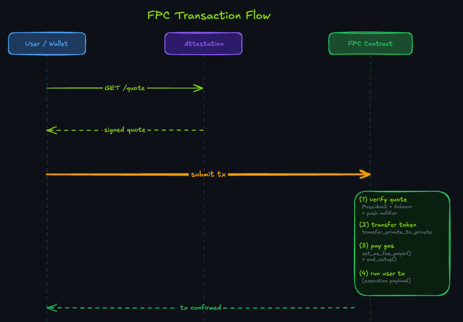

# Aztec FPC

## TLDR

FPC (Fee Payment Contract) is a smart contract on Aztec that pays transaction gas on the user's behalf. The user pays the operator back in a token they already hold, at a rate locked by a signed quote. Nethermind's `aztec-fpc` is the production multi-asset implementation: one contract instance, any number of accepted tokens, no redeployment to add a new asset. The operator funds Fee Juice, sets pricing via `fee_bips`, and keeps the spread.

## Components

| Component | Role |
|-----------|------|
| **[FPC Contract](https://github.com/NethermindEth/aztec-fpc/blob/main/contracts/fpc/src/main.nr)** (`FPCMultiAsset`) | On-chain fee payer. Verifies operator-signed quotes, transfers tokens from user to operator, pays Fee Juice to the protocol. |
| **[Attestation Service](https://github.com/NethermindEth/aztec-fpc/blob/main/services/attestation/src/server.ts)** | REST API that signs per-user fee quotes with the operator's Schnorr key. Serves wallet discovery metadata at `/.well-known/fpc.json`. |
| **[Top-up Service](https://github.com/NethermindEth/aztec-fpc/blob/main/services/topup/src/index.ts)** | Monitors the FPC's Fee Juice balance on L2 and bridges more from L1 when it drops below a threshold. |
| **[SDK](https://github.com/NethermindEth/aztec-fpc/blob/main/sdk/src/payment-method.ts)** (`@nethermindeth/aztec-fpc-sdk`) | TypeScript client that handles quote fetching, auth-witness construction, and transaction submission. |

| | |
|---|---|
| **Tokens accepted** | Any token the operator configures |
| **Cold-start** | 1 tx from L1 bridge to active L2 account |
| **On-chain allowlist** | None required (quote-binding enforces asset selection) |
| **SDK surface** | 2 methods |

[GitHub](https://github.com/NethermindEth/aztec-fpc) | [SDK Getting Started](sdk.md) | [Testnet Deployment](./reference/testnet-deployment.md)

---

## What is FPC?

Every Aztec transaction requires Fee Juice, the protocol's native gas token. Users who bridge assets from Ethereum, wallets serving non-technical audiences, and apps accepting their own token all face the same barrier: Fee Juice has to come from somewhere before anything else can happen.

FPC (Fee Payment Contract) moves that responsibility to an operator. The operator holds Fee Juice and pays it on the user's behalf. The user pays the operator in a token they already have, at a rate the operator sets and commits to in a signed quote. The on-chain contract verifies the quote and executes the transfer atomically.

Nethermind's `aztec-fpc` is the production multi-asset implementation. One contract instance serves any number of accepted tokens. Adding a new token requires no redeployment.

### How a standard transaction works



The wallet requests a quote from the attestation service, which prices the Fee Juice cost in the user's token and signs it with the operator's Schnorr key. The user includes the operator's quote signature in their transaction alongside a transfer authorization witness (authwit). The authwit authorizes the token transfer and is carried as an execution payload component, not a function argument to `fee_entrypoint`.

The FPC contract reconstructs the quote hash via `compute_inner_authwit_hash` over the quote fields (domain separator, FPC address, accepted asset, Fee Juice amount, payment amount, expiry, and user address), verifies the Schnorr signature against the stored operator public key, pushes a nullifier to prevent replay, and then calls `transfer_private_to_private` to move the payment from the user's private balance to the operator's private balance. All of this executes in the setup phase. The contract then calls `set_as_fee_payer()` and `end_setup()`, committing the fee payment before the user's app logic runs.

### What FPC does not do

FPC does not eliminate gas costs. It shifts who pays them and in what token. The operator takes on the operational cost of keeping the FPC funded with Fee Juice and recoups it through a configurable spread per token. The spread is set as `fee_bips` in the attestation service configuration and is applied off-chain when pricing quotes. The on-chain contract has no knowledge of `fee_bips`. It verifies and settles whatever signed amounts the attestation service produced.

Quote signatures are user-specific and single-use. A quote issued to one user cannot be used by another, and a consumed quote cannot be replayed. The operator is not exposed to a free-rider problem, but they are exposed to market rate risk if the token value moves between quote issuance and settlement.

There is no on-chain asset allowlist. The contract does not enforce which tokens are accepted. Protection comes entirely from the quote signature: `accepted_asset` is part of the signed `compute_inner_authwit_hash` preimage, so substituting a different token at call time invalidates the signature.

Operator key rotation requires deploying a new contract. The public key is stored in `PublicImmutable` and cannot be updated.

### Comparison with Aztec's Sponsored FPC

Aztec Labs ships a [Sponsored FPC](https://docs.aztec.network/developers/docs/aztec-js/how_to_pay_fees) on testnet, devnet, and local networks. It is not deployed on mainnet. It pays for every transaction with no token required from the user. It is a pure subsidy with no payment mechanism and no operator revenue.

| | Sponsored FPC | Nethermind FPC |
|---|---|---|
| **Accepted tokens** | None, fully sponsored | Any token the operator configures |
| **Operator revenue** | None | Configurable `fee_bips` spread per asset |
| **Quote system** | None | Schnorr-signed, single-use, user-bound |
| **Cold-start (L1 to first tx)** | Not supported | Supported via `cold_start_entrypoint` |
| **Off-chain services** | None | Attestation service and top-up daemon |
| **Who runs it** | Aztec Labs | You |

The Sponsored FPC is the right choice for development and testing where gasless UX is the only goal. On mainnet, you need either Fee Juice bridged from L1 or a deployed fee-paying contract. Nethermind's FPC covers the latter, with real token payments, operator revenue, and cold-start onboarding included.

---

## Quick Example

```typescript
import { FpcClient } from "@nethermindeth/aztec-fpc-sdk";

// Standard flow: user already has L2 tokens
const { fee } = await fpcClient.createPaymentMethod({
  wallet,
  user: userAddress,
  tokenAddress,
  estimatedGas,
});
await contract.methods.transfer(recipient, amount).send({ fee });

// Cold-start: user just bridged from L1
const result = await fpcClient.executeColdStart({
  wallet,
  userAddress,
  tokenAddress,
  bridgeAddress,
  bridgeClaim,
});
```

---

## Start Here

| You are... | Goal | Start here |
|---|---|---|
| **dApp developer** | Use an existing FPC operator or run your own | [SDK Getting Started](sdk.md) |
| **Wallet team / operator** | Deploy the contract, configure attestation, surface FPC in your wallet | [Testnet Deployment](./reference/testnet-deployment.md) |
| **Bridge / onboarding UX** | Claim bridged tokens, pay gas, deliver the remainder in one atomic tx | [SDK Getting Started](sdk.md#cold-start-flow-user-just-bridged-from-l1) |
| **Auditor** | Quote binding, setup-phase irreversibility, replay protection, operator key custody | [Security](./security.md) |

> [!TIP]
> **Wallet teams running their own FPC** combine the operator and integrator roles. Start with the [SDK Getting Started](sdk.md), then follow the [Run an Operator](./how-to/run-operator.md) guide to deploy and fund your own instance.

---

## Documentation

| Section | Pages |
|---|---|
| **Overview** | [Architecture](architecture.md), [Quote System](quote-system.md), [Security](security.md), [Quick Start](quick-start.md) |
| **SDK** | [Getting Started](sdk.md), [API Reference](sdk.md#api-reference) |
| **Contracts** | [Overview](contracts.md), [FPCMultiAsset](contracts.md#fpcmultiasset), [Faucet](contracts.md#faucet), [Token Bridge](contracts.md#tokenbridge) |
| **Services** | [Attestation](services.md), [Top-up](services.md#top-up-service) |
| **How-to** | [Run an Operator](./how-to/run-operator.md), [Integrate Wallet](./how-to/integrate-wallet.md), [Add Supported Asset](./how-to/add-supported-asset.md), [Cold-Start Flow](./how-to/cold-start-flow.md) |
| **Operations** | [Configuration](./operations/configuration.md), [Deployment](./operations/deployment.md), [Docker](./operations/docker.md), [Testing](./operations/testing.md) |
| **Reference** | [Glossary](./reference/glossary.md), [Metrics](./reference/metrics.md), [E2E Test Matrix](./reference/e2e-test-matrix.md), [Testnet Deployment](./reference/testnet-deployment.md), [Wallet Discovery](./reference/wallet-discovery.md), [Asset Model ADR](https://github.com/NethermindEth/aztec-fpc/blob/main/docs/docs-legacy/spec/adr-0001-alpha-asset-model.md) |

---

*Aztec FPC, Nethermind, MIT License*
