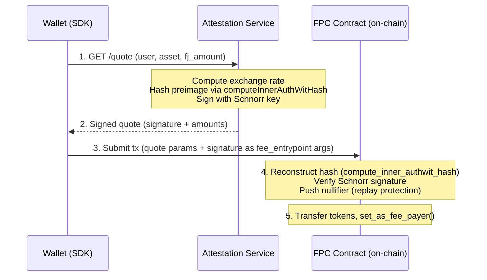

# Quote System

A fee quote is a signed commitment from the operator: "I will accept `aa_payment_amount` of `accepted_asset` in exchange for paying `fj_fee_amount` of Fee Juice for this user's transaction, valid until `valid_until`."

The attestation service signs these off-chain. The FPC contract verifies them on-chain. This page covers the hash format, signing mechanics, exchange rate computation, and security properties.

## Source files

- Contract verification: [`contracts/fpc/src/main.nr`](https://github.com/NethermindEth/aztec-fpc/blob/main/contracts/fpc/src/main.nr#L252) (functions `assert_valid_quote`, `assert_valid_cold_start_quote`)
- Quote signing: [`services/attestation/src/signer.ts`](https://github.com/NethermindEth/aztec-fpc/blob/main/services/attestation/src/signer.ts#L88)
- Exchange rate computation: [`services/attestation/src/config.ts`](https://github.com/NethermindEth/aztec-fpc/blob/main/services/attestation/src/config.ts#L572) (`computeFinalRate`)
- Quote endpoint: [`services/attestation/src/server.ts`](https://github.com/NethermindEth/aztec-fpc/blob/main/services/attestation/src/server.ts#L581)

## Lifecycle



1. **User requests a quote.** The wallet calls `GET /quote?user=<addr>&accepted_asset=<addr>&fj_amount=<amount>` on the attestation service. The `fj_amount` must equal `get_max_gas_cost` for the transaction gas settings.

2. **Attestation service signs the quote.** The service computes the exchange rate, creates a hash of the quote parameters using `computeInnerAuthWitHash` from `@aztec/stdlib/auth-witness`, and signs the 32-byte hash with the operator's Schnorr key. It returns a 64-byte hex signature.

3. **User includes the quote in the transaction.** The signature and quote parameters are passed as arguments to `fee_entrypoint`. A separate token transfer authwit (authorizing the FPC to pull `aa_payment_amount` from the user) is carried in `authWitnesses`, not as a function argument.

4. **Contract verifies on-chain.** The FPC contract reconstructs the hash using `compute_inner_authwit_hash` (the Noir equivalent), verifies the Schnorr signature against the stored operator public key (`operator_pubkey_x`, `operator_pubkey_y` from the packed immutable config), and pushes the quote hash as a nullifier.

5. **Quote is consumed.** The nullifier prevents the same quote from being used again. The contract transfers tokens and calls `set_as_fee_payer()`.

## Quote types

### Normal quote (`fee_entrypoint`)

| Field | Value |
|-------|-------|
| Domain separator | `0x465043` (ASCII: `FPC`) |
| Hash function | `compute_inner_authwit_hash` |
| Signature | Schnorr (64 bytes) |

**Hash preimage (7 fields):**

```noir
compute_inner_authwit_hash([
    0x465043,           // domain separator
    fpc_address,        // this contract's address
    accepted_asset,     // token contract address
    fj_fee_amount,      // Fee Juice amount
    aa_payment_amount,  // token payment amount
    valid_until,        // expiry timestamp (u64, unix)
    user_address,       // msg_sender (the paying user, never zero)
])
```

### Cold-start quote (`cold_start_entrypoint`)

| Field | Value |
|-------|-------|
| Domain separator | `0x46504373` (ASCII: `FPCs`) |
| Hash function | `compute_inner_authwit_hash` |
| Signature | Schnorr (64 bytes) |

**Hash preimage (9 fields):**

```noir
compute_inner_authwit_hash([
    0x46504373,          // different domain separator
    fpc_address,
    accepted_asset,
    fj_fee_amount,
    aa_payment_amount,
    valid_until,
    user_address,        // explicit param (not msg_sender)
    claim_amount,        // amount being claimed from the bridge
    claim_secret_hash,   // hash of the claim secret
])
```

> [!WARNING]
> **Bridge address and `message_leaf_index` are not in the preimage**
>
> The contract accepts `bridge` and `message_leaf_index` as function arguments to `cold_start_entrypoint`, but they are not signed by the operator. Only `claim_amount` and `claim_secret_hash` bind the quote to a specific bridge deposit. The bridge address can be chosen by the caller at transaction time. The operator trusts that the claim will be honored because the mint goes to the FPC first, and the contract only distributes what was actually claimed.

> [!WARNING]
> The different domain separators prevent cross-entrypoint quote reuse. A quote signed for `fee_entrypoint` will fail verification in `cold_start_entrypoint`, and vice versa.

## Exchange rate computation

The attestation service computes the token payment from the Fee Juice amount using `computeFinalRate` ([source](https://github.com/NethermindEth/aztec-fpc/blob/main/services/attestation/src/config.ts#L572)).

Per-asset pricing is configured per entry in the asset policy store (`market_rate_num`, `market_rate_den`, `fee_bips`).

```
final_rate_num = market_rate_num × (10000 + fee_bips)
final_rate_den = market_rate_den × 10000

aa_payment_amount = ceil(fj_amount × final_rate_num / final_rate_den)
```

**Example:** If `market_rate_num = 1`, `market_rate_den = 1000`, and `fee_bips = 200` (2%):

```
fj_amount         = 1,000,000
final_rate_num    = 1 × (10000 + 200) = 10200
final_rate_den    = 1000 × 10000       = 10000000
aa_payment_amount = ceil(1,000,000 × 10200 / 10000000) = ceil(1020) = 1020
```

The on-chain contract has no knowledge of `fee_bips`, `market_rate_num`, or `market_rate_den`. It receives and enforces the final `aa_payment_amount` as signed by the operator. Rate changes take effect at quote signing time and require no contract interaction.

## Quote format: `amount_quote` vs `rate_quote`

[Source: `config.ts`](https://github.com/NethermindEth/aztec-fpc/blob/main/services/attestation/src/config.ts#L33) | [Source: `signer.ts`](https://github.com/NethermindEth/aztec-fpc/blob/main/services/attestation/src/signer.ts#L72)

The attestation service supports two quote preimage formats, controlled by the `quote_format` config key (default: `amount_quote`).

**`amount_quote` (default):** Signs concrete amounts. Positions 3-4 in the preimage are `fj_fee_amount` and `aa_payment_amount`. This is what the on-chain contract verifies.

**`rate_quote`:** Signs the exchange rate instead. Positions 3-4 in the preimage are `rate_num` and `rate_den`.

```noir
// amount_quote preimage (7 fields) -- default
compute_inner_authwit_hash([
    0x465043, fpc_address, accepted_asset,
    fj_fee_amount, aa_payment_amount,     // <-- concrete amounts
    valid_until, user_address,
])

// rate_quote preimage (7 fields)
compute_inner_authwit_hash([
    0x465043, fpc_address, accepted_asset,
    rate_num, rate_den,                    // <-- exchange rate
    valid_until, user_address,
])
```

Both formats use the same domain separator (`0x465043`) and produce a 7-field preimage. The response for `rate_quote` includes two extra fields:

```json
{
  "accepted_asset": "0x...",
  "fj_amount": "1000000",
  "aa_payment_amount": "1020",
  "valid_until": "1700000300",
  "signature": "0x...",
  "rate_num": "10200",
  "rate_den": "10000000"
}
```

> [!NOTE]
> The `rate_quote` format requires a contract that verifies rate-based preimages. The current `FPCMultiAsset` contract verifies `amount_quote` only. Use `rate_quote` only if your contract fork expects `(rate_num, rate_den)` in the preimage.

## Security properties

| Property | How it is enforced |
|----------|-------------------|
| **Authenticity** | Schnorr signature verified against immutable on-chain pubkey |
| **Integrity** | `compute_inner_authwit_hash` covers all parameters; any change breaks the signature |
| **Replay protection** | Quote hash pushed as nullifier; duplicates fail via nullifier conflict |
| **User binding** | Hash includes user address; User A cannot use User B's quote |
| **Freshness** | `anchor_block_timestamp <= valid_until` |
| **TTL cap** | `(valid_until - anchor_block_timestamp) <= 3600` seconds (max 1 hour lifetime) |
| **Expiration enforcement** | `context.set_expiration_timestamp(valid_until)` prevents inclusion after expiry |
| **Domain separation** | Different domain separators per entrypoint (`0x465043` vs `0x46504373`) |
| **Asset binding** | `accepted_asset` is in the signed preimage; substituting a different token at call time invalidates the signature |

## Quote response format

The attestation service returns:

```json
{
    "accepted_asset": "0x1234...abcd",
    "fj_amount": "1000000",
    "aa_payment_amount": "1010000",
    "valid_until": "1700000300",
    "signature": "0xabcd...1234"
}
```

All numeric fields (`fj_amount`, `aa_payment_amount`, `valid_until`) are returned as strings to preserve full u128 and unix-timestamp precision across JSON.

The cold-start quote endpoint (`GET /cold-start-quote`) returns the same fields plus `claim_amount` and `claim_secret_hash`. The attestation service validates that `claim_amount >= aa_payment_amount` before signing a cold-start quote.

Deterministic `400 BAD_REQUEST` responses cover missing or invalid `user`, missing or invalid `accepted_asset`, unsupported `accepted_asset`, missing or invalid `fj_amount`, and computed overflow for `aa_payment_amount`.

This response is consumed directly by the SDK's `createPaymentMethod()` or `executeColdStart()`.
